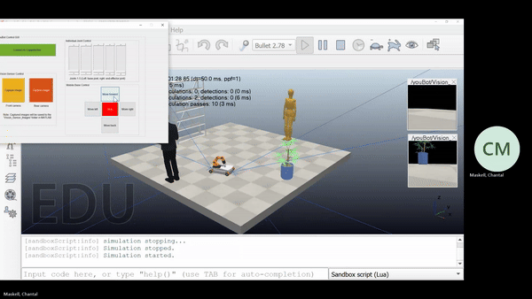

Solo university assignment to create a teleoperation system in MATLAB to remotely control a Kuka youBot (KYB) in CoppeliaSim (formerly V-rep). MATLAB's GUIDE was used to create the GUI for all robot controls.

MATLAB's GUIDE was used to create the GUI for all robot controls (pictured below).

The Kuka youBot was fitted with two vision sensors (front and rear) on the mobile base. Images can be captured via the GUI which are saved locally in Matlab.

